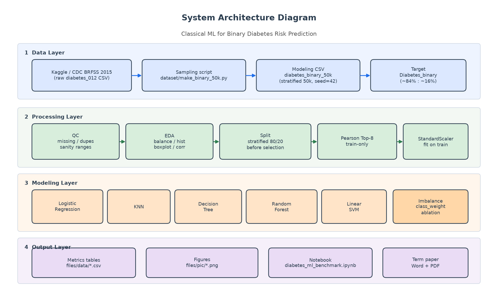
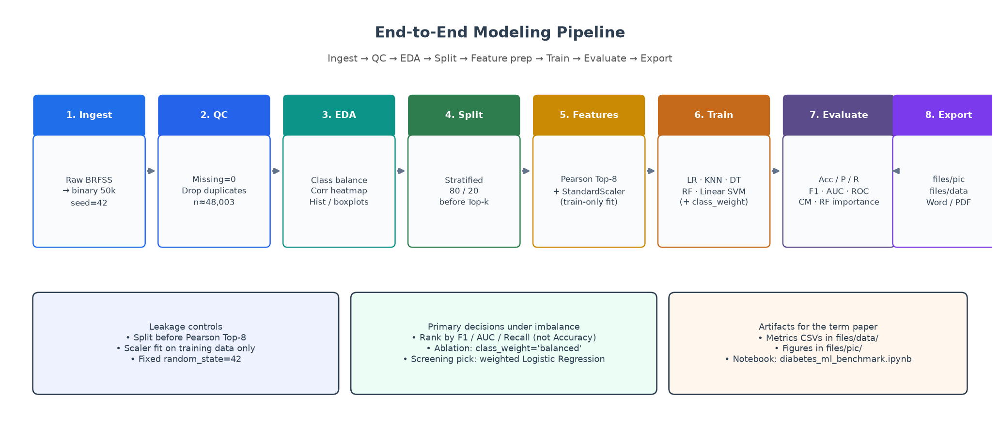

# Classical ML for Binary Diabetes Risk Prediction

MDS 5 – Predictive Analytics course project.

Benchmark classical machine learning models on a **stratified 50,000-row** BRFSS diabetes health indicators subset (binary risk prediction).

This README is the technical system documentation for the public GitHub repository: task contract, architecture, data, models, results, and limitations.

**Main notebook:** [`diabetes_ml_benchmark.ipynb`](diabetes_ml_benchmark.ipynb)  
**Course paper:** [`Classical_ML_Binary_Diabetes_Risk_Prediction_YueMa.docx`](Classical_ML_Binary_Diabetes_Risk_Prediction_YueMa.docx) · [`Classical_ML_Binary_Diabetes_Risk_Prediction_YueMa.pdf`](Classical_ML_Binary_Diabetes_Risk_Prediction_YueMa.pdf)

---

## Architecture Diagram

High-level schematic of system components, data flow, and pipeline stages (Documentation Standards):



**Layers**

| Layer | Components |
|-------|------------|
| Data | Kaggle / CDC BRFSS raw CSV → `dataset/make_binary_50k.py` → stratified 50k modeling CSV (`Diabetes_binary`) |
| Processing | QC → EDA → stratified 80/20 split → train-only Pearson Top-8 → `StandardScaler` (fit on train) |
| Modeling | Logistic Regression, KNN, Decision Tree, Random Forest, Linear SVM + `class_weight` ablation |
| Output | `files/data` metrics tables, `files/pic` figures, notebook exports, Word/PDF term paper |

---

## End-to-end pipeline

Overall modeling pipeline from ingest to paper-ready exports:



Stage summary: **Ingest → QC → EDA → Split → Feature prep → Train → Evaluate → Export**.

### Metrics and split protocol

| Item | Definition / setting |
|------|----------------------|
| Split | Stratified `train_test_split`, `test_size=0.2`, `random_state=42` |
| Feature selection | Pearson \|r\| with target on **training set only**; keep Top-8 |
| Scaling | `StandardScaler` fit on train; transform train/test |
| Accuracy | Overall correct rate (misleading under ~16% positives) |
| Precision / Recall / F1 | Positive class = `Diabetes_binary=1` |
| AUC | ROC AUC from `predict_proba` or decision scores |
| Imbalance ablation | LR / RF with `class_weight=None` vs `'balanced'` |

---

## Task definition

| Item | Value |
|------|--------|
| Task | Binary classification |
| Target | `Diabetes_binary` |
| Positive class (`1`) | Prediabetes **or** diabetes |
| Negative class (`0`) | No diabetes |
| Sample size | **50,000** (stratified) |
| Random seed | **42** |
| Class ratio (approx.) | **~84% : ~16%** (negative : positive) |
| Primary metrics | **F1 / AUC** (also report Accuracy, Precision, Recall; do not rank models by Accuracy alone) |

Features are already numeric (binary / ordinal / continuous). No Label Encoding required; scaling matters for LR / KNN / SVM.

---

## Data Documentation

### Source and schema

- Kaggle: [Diabetes Health Indicators Dataset](https://www.kaggle.com/datasets/alexteboul/diabetes-health-indicators-dataset) (CDC BRFSS 2015)
- Field notes and sampling details: [`dataset/README.md`](dataset/README.md)
- Target mapping: `Diabetes_012` → `Diabetes_binary` (0 stays 0; 1 and 2 → 1)

### Reproduce the 50k modeling file

1. Download the raw Kaggle file `diabetes_012_health_indicators_BRFSS2015.csv` into `dataset/` (CSV files are gitignored).
2. Run:

```bash
python dataset/make_binary_50k.py
```

3. Output: `dataset/diabetes_binary_50k_stratified.csv`  
   - Stratified sample of 50,000 rows with `random_state=42`

### Preprocessing and quality assumptions

- Missing values checked (expect none on the modeling slice).
- Exact duplicate rows dropped before EDA/modeling (n ≈ 48,003 after de-duplication).
- BMI and unhealthy-day fields checked for plausible ranges.
- Feature selection and scaling are **train-only** to avoid leakage.
- Class imbalance (~16% positives) is treated as a modeling constraint, not ignored.

### EDA highlights

1. Class balance ≈ **83.6% : 16.4%** → do not rank models by Accuracy alone.
2. Strongest \|Pearson\| with target: GenHlth, HighBP, BMI, DiffWalk, HighChol (then Age, HeartDiseaseorAttack, Income).
3. Scale differences (BMI / MentHlth / PhysHlth) motivate `StandardScaler` for LR / KNN / SVM.
4. EDA figures: `files/pic/class_balance.png`, `feature_histograms.png`, `feature_boxplots_by_class.png`, `correlation_heatmap.png`.

### Feature-prep highlights

- Stratified 80/20 split (`random_state=42`) **before** feature selection.
- Train-only Pearson Top-8: GenHlth, HighBP, BMI, DiffWalk, HighChol, Age, HeartDiseaseorAttack, Income.
- `StandardScaler` fit on train only; shared scaled features for later models.
- Export: `files/data/selected_features.csv`.

---

## Local setup (reproducibility)

Do **not** commit `.venv/`. Create a local environment and install:

```bash
python -m venv .venv
# Windows PowerShell:
.\.venv\Scripts\Activate.ps1
pip install -r requirements.txt
```

Then regenerate the modeling CSV (after placing the raw Kaggle file in `dataset/`) and run [`diabetes_ml_benchmark.ipynb`](diabetes_ml_benchmark.ipynb).

---

## Model Card / Algorithm Justification

| Algorithm | Why included | Notes |
|-----------|--------------|--------|
| Logistic Regression | Interpretable linear baseline; supports `class_weight` | Strong AUC; best screening pick when weighted |
| KNN | Non-parametric neighborhood baseline | Needs scaling; highest **default** F1 in this run |
| Decision Tree | Transparent rules; no scaling required | Easy to overfit; moderate AUC |
| Random Forest | Strong tabular ensemble; feature importances | Good AUC; supports class-weight ablation |
| Linear SVM | Margin-based linear comparator | Highest default AUC here; low positive Recall without weighting |

**Evaluation metrics:** Accuracy, Precision, Recall, F1, AUC (plus ROC, confusion matrix, RF importances).  
**Hyperparameters:** sklearn defaults with fixed `random_state=42` where applicable; imbalance handled via `class_weight='balanced'` ablation (not SMOTE in the main protocol).  
**Interpretability:** LR coefficients (linear), Decision Tree / RF importances; Pearson Top-8 keeps the feature set small for reporting.

---

## Results & Limitations

Hold-out metrics (default weights; sorted by F1). Prefer **F1 / AUC / Recall** over Accuracy under ~16% positives.

| Model | Accuracy | Precision | Recall | F1 | AUC |
|------|----------|-----------|--------|-----|-----|
| KNN | 0.8170 | 0.4004 | 0.2352 | **0.2964** | 0.7087 |
| Decision Tree | 0.8352 | 0.4931 | 0.2034 | 0.2880 | 0.7706 |
| Random Forest | 0.8393 | 0.5284 | 0.1774 | 0.2656 | 0.8017 |
| Logistic Regression | 0.8410 | 0.5467 | 0.1710 | 0.2605 | 0.8067 |
| Linear SVM | 0.8416 | 0.6024 | 0.0973 | 0.1675 | **0.8070** |

Class-weight ablation (LR / RF):

| Setting | Accuracy | Recall | F1 | AUC |
|---------|----------|--------|-----|-----|
| LR (none) | 0.8410 | 0.1710 | 0.2605 | 0.8067 |
| LR (balanced) | 0.7233 | **0.7463** | **0.4691** | 0.8074 |
| RF (none) | 0.8393 | 0.1774 | 0.2656 | 0.8017 |
| RF (balanced) | 0.7388 | **0.6993** | **0.4673** | 0.7976 |

**Recommendation (Conclusions-ready):** for screening-oriented minority detection, prefer **`class_weight='balanced'` Logistic Regression**. It raises positive Recall/F1 while keeping strong AUC, stays cheap to train, and remains interpretable. Do not pick models by Accuracy alone; default-threshold KNN F1 is higher than unweighted LR but weaker on ranking (AUC) and screening Recall after weighting.

Figures: `roc_curves_benchmark.png`, `confusion_matrix_best.png`, `rf_feature_importance.png`, `imbalance_f1_recall_comparison.png`, `metrics_bar_benchmark.png`.  
Tables: `files/data/metrics_benchmark.csv`, `metrics_imbalance_ablation.csv`.

### Limitations and future work

- Single stratified hold-out (no nested CV); timing and small metric noise can vary by machine.
- Self-reported BRFSS features include noise; correlation ≠ causation.
- Default decision threshold (0.5) is not cost-sensitive; calibration / threshold tuning not fully explored.
- Main protocol uses class weights, not resampling (SMOTE / undersampling) or full BRFSS feature set.
- Future work: nested CV, probability calibration, resampling comparisons, SHAP-style explanations.

---

## Theory notes (diabetes setting)

Short assumptions used in the term-paper Theory / Conclusions sections:

| Model | Core assumption / intuition here |
|-------|-----------------------------------|
| Logistic Regression | Log-odds of diabetes risk are roughly linear in scaled Top-8 features; class weights rebalance the loss toward the minority (prediabetes/diabetes). |
| KNN | Similar health profiles (BMI, BP, GenHlth, …) share similar labels in local neighborhoods; sensitive to feature scale and imbalance. |
| Decision Tree | Axis-aligned splits on clinical/self-report features can form readable rules; deep trees overfit survey noise. |
| Random Forest | Averaging many trees stabilizes predictions and yields Gini/importance cues; still benefits from class weights under skew. |
| Linear SVM | Separates classes with a max-margin hyperplane in scaled space; without weighting it can favor the majority class. |

**Literature directions (used in the paper):** BRFSS / health-indicator risk prediction; classical classifiers on tabular clinical survey data; imbalanced learning evaluation (F1 / Recall / ROC-AUC rather than Accuracy alone).

---

## Reproducibility checklist

| Item | Value |
|------|--------|
| Random seed | `42` (sampling, split, and sklearn `random_state` where used) |
| Test split | Stratified 80/20 |
| Features | Train-only Pearson Top-8 + train-fit `StandardScaler` |
| Main entry | `diabetes_ml_benchmark.ipynb` |
| Data builder | `python dataset/make_binary_50k.py` |
| Dependencies | `requirements.txt` (pinned ranges) |
| Verified local versions (example) | pandas 3.0.5 · numpy 2.5.1 · scikit-learn 1.9.0 · matplotlib 3.11.1 · seaborn 0.13.2 |
| Colab | Optional: open the notebook in Google Colab from the GitHub repo and upload / download the 50k CSV as needed (no separate Colab notebook is required) |
| Secrets | `.env` is gitignored; do not commit API keys |

**Clone-and-run path**

1. `git clone` this repo → create `.venv` → `pip install -r requirements.txt`
2. Place the raw Kaggle CSV in `dataset/` → run `python dataset/make_binary_50k.py`
3. Execute `diabetes_ml_benchmark.ipynb` top to bottom (exports land in `files/pic` and `files/data`)

---

## Submission checklist

- [x] Term paper Word + PDF in repo root (`*_YueMa.docx` / `*_YueMa.pdf`)
- [x] Public GitHub implementation (notebook + sampling script + exports)
- [x] Data access documented (Kaggle link + `dataset/README.md`; large CSVs not committed)
- [x] Architecture + pipeline diagrams in README (`files/pic/architecture_diagram.png`, `pipeline_overview.png`)
- [x] Results tables and limitations documented above
- [ ] Sign / attach the course **Affidavit** (academic integrity) with the LMS upload if required
- [ ] Confirm paper formatting (Arial 11, double spacing, APA 6 references) before final LMS submit

**Release hygiene:** no tracked `.env`; modeling CSVs remain gitignored; architecture/results figures are small PNG/CSV exports only.

---

## Repository boundaries

| Path | In Git? | Notes |
|------|---------|--------|
| `dataset/*.py`, `dataset/README.md` | Yes | Reproduce sampling |
| `dataset/*.csv` | No | Ignored via `*.csv` |
| `diabetes_ml_benchmark.ipynb` | Yes | Main experiment notebook |
| `files/pic/`, `files/data/*.csv` | Yes | Paper Analysis inputs (small exports) |
| `Classical_ML_Binary_Diabetes_Risk_Prediction_YueMa.docx/.pdf` | Yes | Course submission paper |
| `file/` | No | Local course notes / drafts |
| `.env` | No | Secrets |

---

## License / course

Academic coursework for MDS 5 Predictive Analytics. Data remains under the original Kaggle / CDC terms.
