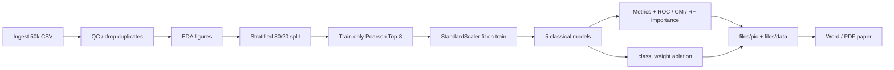

# Classical ML for Binary Diabetes Risk Prediction

MDS 5 – Predictive Analytics course project.

Benchmark classical machine learning models on a **stratified 50,000-row** BRFSS diabetes health indicators subset (binary risk prediction).

**Repository contract (Issue #1):** this README + `dataset/` define the task, sampling protocol, and how to reproduce the modeling CSV. Large CSVs, secrets, and local notes under `file/` are **not** committed.

---

## Task definition

| Item | Value |
|------|--------|
| Task | Binary classification |
| Target | `Diabetes_binary` |
| Positive class (`1`) | Prediabetes **or** diabetes |
| Negative class (`0`) | No diabetes |
| Sample size | **50,000** (stratified) |
| Random seed | **42** |
| Class ratio (approx.) | **~84% : ~16%** (negative : positive) |
| Primary metrics | **F1 / AUC** (also report Accuracy, Precision, Recall; do not rank models by Accuracy alone) |

Features are already numeric (binary / ordinal / continuous). No Label Encoding required; scaling matters for LR / KNN / SVM.

---

## Data source

- Kaggle: [Diabetes Health Indicators Dataset](https://www.kaggle.com/datasets/alexteboul/diabetes-health-indicators-dataset) (CDC BRFSS 2015)
- Full pipeline docs (fields + sampling): [`dataset/README.md`](dataset/README.md)

### Reproduce the 50k modeling file

1. Download the raw Kaggle file `diabetes_012_health_indicators_BRFSS2015.csv` into `dataset/` (CSV files are gitignored).
2. Run:

```bash
python dataset/make_binary_50k.py
```

3. Output: `dataset/diabetes_binary_50k_stratified.csv`  
   - Maps `Diabetes_012` → `Diabetes_binary` (0 stays 0; 1 and 2 → 1)  
   - Stratified sample of 50,000 rows with `random_state=42`

---

## Local setup (venv + requirements)

Do **not** commit `.venv/`. Create a local environment and install:

```bash
python -m venv .venv
# Windows PowerShell:
.\.venv\Scripts\Activate.ps1
pip install -r requirements.txt
```

Then regenerate the modeling CSV (after placing the raw Kaggle file in `dataset/`):

```bash
python dataset/make_binary_50k.py
```

---

## Issue → commit workflow (required)

**Every closed GitHub Issue must be backed by at least one local commit** whose message references the issue (e.g. `(#2)`).

1. Implement only that Issue’s scope  
2. `git commit` (English message, include `#N`)  
3. Close the Issue (after the commit exists)  
4. Optionally push when ready  

Do **not** close an Issue with no corresponding commit.

---

## Planned pipeline

Ingest → QC → EDA → scale → Pearson Top-k → train ≥4 classical models → evaluate (F1/AUC/Recall) → optional `class_weight` ablation → export figures/tables.

**Final acceptance notebook:** [`diabetes_ml_benchmark.ipynb`](diabetes_ml_benchmark.ipynb) (all Issues append to this file).

### Pipeline architecture (Issue #5)



### Metrics and split protocol

| Item | Definition / setting |
|------|----------------------|
| Split | Stratified `train_test_split`, `test_size=0.2`, `random_state=42` |
| Feature selection | Pearson \|r\| with target on **training set only**; keep Top-8 |
| Scaling | `StandardScaler` fit on train; transform train/test |
| Accuracy | Overall correct rate (misleading under ~16% positives) |
| Precision / Recall / F1 | Positive class = `Diabetes_binary=1` |
| AUC | ROC AUC from `predict_proba` or decision scores |
| Imbalance ablation | LR / RF with `class_weight=None` vs `'balanced'` |

Word-ready exports live under `files/pic/` and `files/data/` (stable filenames for captions).

**Course paper (Word + PDF):**  
[`Classical_ML_Binary_Diabetes_Risk_Prediction_YueMa.docx`](Classical_ML_Binary_Diabetes_Risk_Prediction_YueMa.docx) ·  
[`Classical_ML_Binary_Diabetes_Risk_Prediction_YueMa.pdf`](Classical_ML_Binary_Diabetes_Risk_Prediction_YueMa.pdf)

---

## EDA highlights (Issue #2)

From `diabetes_ml_benchmark.ipynb` after de-duplication (n ≈ 48,003):

1. **Class imbalance:** ≈ **83.6% : 16.4%** (no diabetes vs prediabetes/diabetes). Do not rank models by Accuracy alone.
2. **Strongest |Pearson| with target:** GenHlth, HighBP, BMI, DiffWalk, HighChol (then Age, HeartDiseaseorAttack, Income).
3. **Scale differences** (BMI / MentHlth / PhysHlth) motivate `StandardScaler` for LR / KNN / SVM.
4. **Vs Adult demo:** features are already numeric → no Label Encoding; focus on scaling + imbalance-aware metrics.
5. EDA figures: `files/pic/class_balance.png`, `feature_histograms.png`, `feature_boxplots_by_class.png`, `correlation_heatmap.png`.

---

## Pipeline highlights (Issue #3)

- Stratified 80/20 split (`random_state=42`) **before** feature selection.
- Train-only Pearson Top-8: GenHlth, HighBP, BMI, DiffWalk, HighChol, Age, HeartDiseaseorAttack, Income.
- `StandardScaler` fit on train only; shared scaled features for later models.
- Export: `files/data/selected_features.csv`.

---

## Model results (Issue #4)

Hold-out metrics (default weights; sorted by F1). Prefer **F1 / AUC / Recall** over Accuracy under ~16% positives.

| Model | Accuracy | Precision | Recall | F1 | AUC |
|------|----------|-----------|--------|-----|-----|
| KNN | 0.8170 | 0.4004 | 0.2352 | **0.2964** | 0.7087 |
| Decision Tree | 0.8352 | 0.4931 | 0.2034 | 0.2880 | 0.7706 |
| Random Forest | 0.8393 | 0.5284 | 0.1774 | 0.2656 | 0.8017 |
| Logistic Regression | 0.8410 | 0.5467 | 0.1710 | 0.2605 | 0.8067 |
| Linear SVM | 0.8416 | 0.6024 | 0.0973 | 0.1675 | **0.8070** |

Class-weight ablation (LR / RF):

| Setting | Accuracy | Recall | F1 | AUC |
|---------|----------|--------|-----|-----|
| LR (none) | 0.8410 | 0.1710 | 0.2605 | 0.8067 |
| LR (balanced) | 0.7233 | **0.7463** | **0.4691** | 0.8074 |
| RF (none) | 0.8393 | 0.1774 | 0.2656 | 0.8017 |
| RF (balanced) | 0.7388 | **0.6993** | **0.4673** | 0.7976 |

**Draft recommendation:** for screening-oriented minority detection, prefer `class_weight='balanced'` (especially Logistic Regression). Do not pick models by Accuracy alone.

Figures: `roc_curves_benchmark.png`, `confusion_matrix_best.png`, `rf_feature_importance.png`, `imbalance_f1_recall_comparison.png`, `metrics_bar_benchmark.png`.  
Tables: `files/data/metrics_benchmark.csv`, `metrics_imbalance_ablation.csv`.

---

## Progress

| Issue | Status | Local commit |
|-------|--------|--------------|
| #1 Docs/Data | Closed | yes |
| #2 EDA | Closed | yes |
| #3 Pipeline | Closed | yes |
| #4 Models + imbalance | Closed | yes (5 models + class_weight ablation) |
| #5 Paper-ready | Closed | yes (exports + README architecture + Word/PDF) |
| #6 Release | Open | — |

---

## Repository boundaries

| Path | In Git? | Notes |
|------|---------|--------|
| `dataset/*.py`, `dataset/README.md` | Yes | Reproduce sampling |
| `dataset/*.csv` | No | Ignored via `*.csv` |
| `diabetes_ml_benchmark.ipynb` | Yes | Final acceptance notebook |
| `files/pic/`, `files/data/*.csv` | Yes | Paper Analysis inputs (small exports) |
| `Classical_ML_Binary_Diabetes_Risk_Prediction_YueMa.docx/.pdf` | Yes | Course submission paper |
| `file/` | No | Local course notes / paper drafts |
| `.env` | No | Secrets |

---

## License / course

Academic coursework for MDS 5 Predictive Analytics. Data remains under the original Kaggle / CDC terms.
